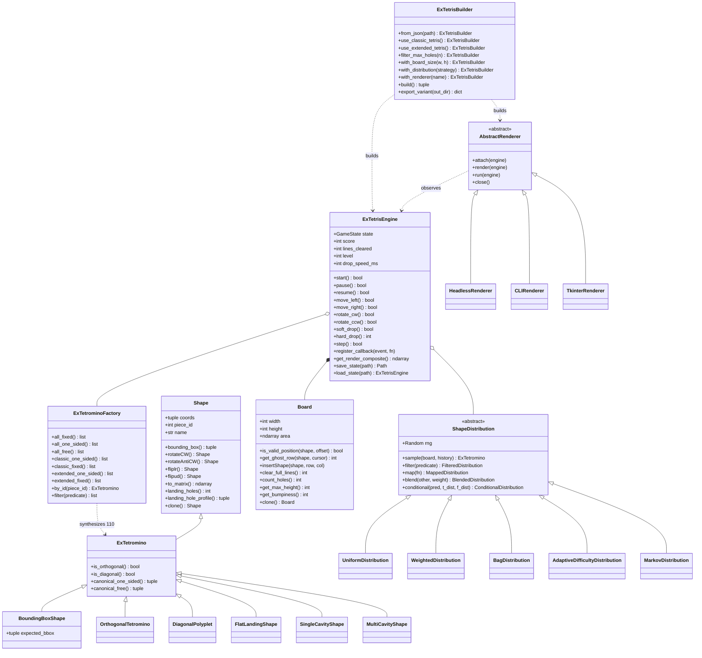
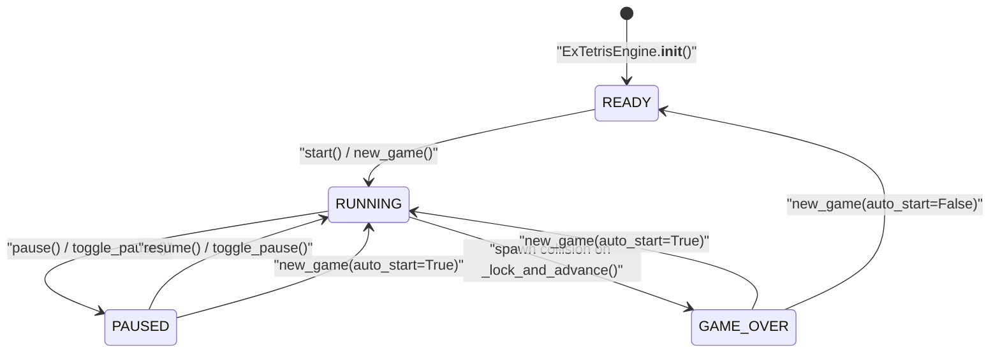
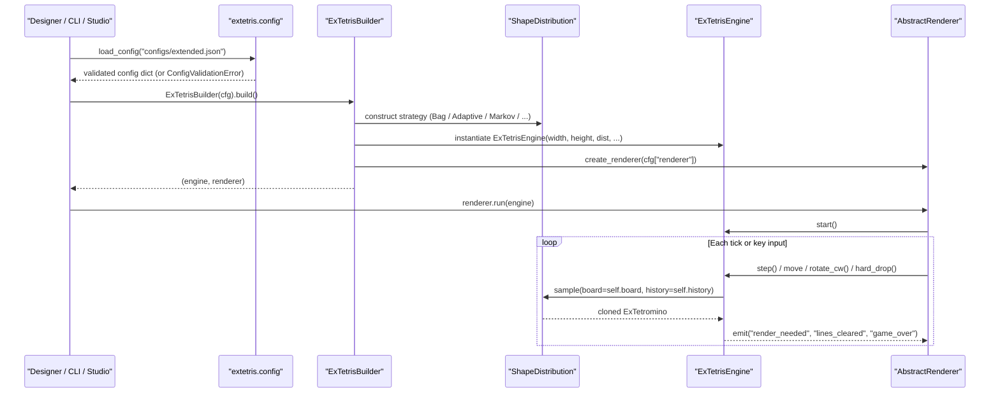

# ExTetris UML Diagrams

## 1. Core Class Hierarchy & Subsystem Relationships

```mermaid
classDiagram
    class Shape {
        +tuple coords
        +int piece_id
        +str name
        +bounding_box() tuple
        +rotateCW() Shape
        +rotateAntiCW() Shape
        +fliplr() Shape
        +flipud() Shape
        +to_matrix() ndarray
        +landing_holes() int
        +landing_hole_profile() tuple
        +clone() Shape
    }

    class ExTetromino {
        +is_orthogonal() bool
        +is_diagonal() bool
        +canonical_one_sided() tuple
        +canonical_free() tuple
    }

    class BoundingBoxShape {
        +tuple expected_bbox
    }
    class OrthogonalTetromino
    class DiagonalPolyplet
    class FlatLandingShape
    class SingleCavityShape
    class MultiCavityShape

    Shape <|-- ExTetromino
    ExTetromino <|-- BoundingBoxShape
    ExTetromino <|-- OrthogonalTetromino
    ExTetromino <|-- DiagonalPolyplet
    ExTetromino <|-- FlatLandingShape
    ExTetromino <|-- SingleCavityShape
    ExTetromino <|-- MultiCavityShape

    class ExTetrominoFactory {
        +all_fixed() list
        +all_one_sided() list
        +all_free() list
        +classic_one_sided() list
        +classic_fixed() list
        +extended_one_sided() list
        +extended_fixed() list
        +by_id(piece_id) ExTetromino
        +filter(predicate) list
    }

    class Board {
        +int width
        +int height
        +ndarray area
        +is_valid_position(shape, offset) bool
        +get_ghost_row(shape, cursor) int
        +insertShape(shape, row, col)
        +clear_full_lines() int
        +count_holes() int
        +get_max_height() int
        +get_bumpiness() int
        +clone() Board
    }

    class ShapeDistribution {
        <<abstract>>
        +Random rng
        +sample(board, history) ExTetromino
        +filter(predicate) FilteredDistribution
        +map(fn) MappedDistribution
        +blend(other, weight) BlendedDistribution
        +conditional(pred, t_dist, f_dist) ConditionalDistribution
    }

    class UniformDistribution
    class WeightedDistribution
    class BagDistribution
    class AdaptiveDifficultyDistribution
    class MarkovDistribution

    ShapeDistribution <|-- UniformDistribution
    ShapeDistribution <|-- WeightedDistribution
    ShapeDistribution <|-- BagDistribution
    ShapeDistribution <|-- AdaptiveDifficultyDistribution
    ShapeDistribution <|-- MarkovDistribution

    class ExTetrisEngine {
        +GameState state
        +int score
        +int lines_cleared
        +int level
        +int drop_speed_ms
        +start() bool
        +pause() bool
        +resume() bool
        +move_left() bool
        +move_right() bool
        +rotate_cw() bool
        +rotate_ccw() bool
        +soft_drop() bool
        +hard_drop() int
        +step() bool
        +register_callback(event, fn)
        +get_render_composite() ndarray
        +save_state(path) Path
        +load_state(path) ExTetrisEngine
    }

    class AbstractRenderer {
        <<abstract>>
        +attach(engine)
        +render(engine)
        +run(engine)
        +close()
    }
    class HeadlessRenderer
    class CLIRenderer
    class TkinterRenderer

    AbstractRenderer <|-- HeadlessRenderer
    AbstractRenderer <|-- CLIRenderer
    AbstractRenderer <|-- TkinterRenderer

    class ExTetrisBuilder {
        +from_json(path) ExTetrisBuilder
        +use_classic_tetris() ExTetrisBuilder
        +use_extended_tetris() ExTetrisBuilder
        +filter_max_holes(n) ExTetrisBuilder
        +with_board_size(w, h) ExTetrisBuilder
        +with_distribution(strategy) ExTetrisBuilder
        +with_renderer(name) ExTetrisBuilder
        +build() tuple
        +export_variant(out_dir) dict
    }

    ExTetrisEngine *-- Board
    ExTetrisEngine o-- ShapeDistribution
    ExTetrisEngine o-- ExTetrominoFactory
    AbstractRenderer ..> ExTetrisEngine : observes
    ExTetrisBuilder ..> ExTetrisEngine : builds
    ExTetrisBuilder ..> AbstractRenderer : builds
    ExTetrominoFactory ..> ExTetromino : synthesizes 110
```

---

## 2. Engine Finite State Machine (4-State FSM)

```mermaid
stateDiagram-v2
    [*] --> READY : "ExTetrisEngine.__init__()"
    READY --> RUNNING : "start() / new_game()"
    RUNNING --> PAUSED : "pause() / toggle_pause()"
    PAUSED --> RUNNING : "resume() / toggle_pause()"
    RUNNING --> GAME_OVER : "spawn collision on _lock_and_advance()"
    GAME_OVER --> RUNNING : "new_game(auto_start=True)"
    GAME_OVER --> READY : "new_game(auto_start=False)"
    PAUSED --> RUNNING : "new_game(auto_start=True)"
```

---

## 3. Variant Assembly & Gameplay Sequence

```mermaid
sequenceDiagram
    participant Designer as "Designer / CLI / Studio"
    participant Loader as "extetris.config"
    participant Builder as "ExTetrisBuilder"
    participant Dist as "ShapeDistribution"
    participant Engine as "ExTetrisEngine"
    participant Renderer as "AbstractRenderer"

    Designer->>Loader: load_config("configs/extended.json")
    Loader-->>Designer: validated config dict (or ConfigValidationError)
    Designer->>Builder: ExTetrisBuilder(cfg).build()
    Builder->>Dist: construct strategy (Bag / Adaptive / Markov / ...)
    Builder->>Engine: instantiate ExTetrisEngine(width, height, dist, ...)
    Builder->>Renderer: create_renderer(cfg["renderer"])
    Builder-->>Designer: (engine, renderer)

    Designer->>Renderer: renderer.run(engine)
    Renderer->>Engine: start()
    loop Each tick or key input
        Renderer->>Engine: step() / move / rotate_cw() / hard_drop()
        Engine->>Dist: sample(board=self.board, history=self.history)
        Dist-->>Engine: cloned ExTetromino
        Engine-->>Renderer: emit("render_needed", "lines_cleared", "game_over")
    end
```
